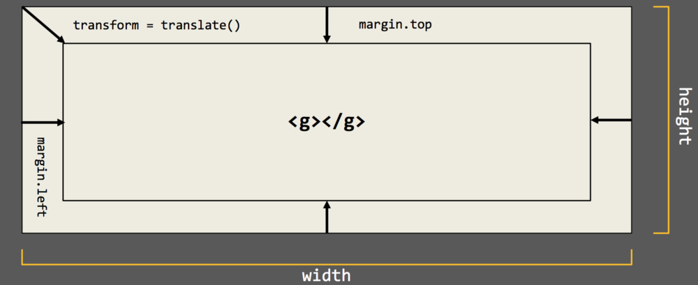
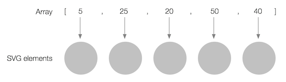

# Basic d3.js

Create a static graphic using [d3.js](https://d3js.org/).

---

### Simple Server Setup

We need to start up a local development server to serve static files like our JavaScript files, CSS stylesheets and CSV data.

##### Step 1

Open up a command prompt.

##### Step 2

Navigate to the directory where you downloaded and unzipped this repository. You'll use the command `cd <folder path>` to navigate the directory tree. (Helpful hint: `cd ..` takes you back up the directory tree one folder.) For example, if you unzipped this directory in a folder called `my_folder`:

```
$ cd my_folder/nicar-d3-2017/basic
```

##### Step 3

Start your simple server from the directory.

Python 2.x
```
$ python -m SimpleHTTPServer
```

Python 3.x

```
$ python -m http.server
```

You're good to go! Open your browser to [localhost:8000](http://localhost:8000/).

---

## Preflight

Notice the directories.

```
basic/
  index.html
  js/
    script.js
  css/
    styles.css
  data/
    oecd_health_data.csv
```

We'll write the code for our d3 chart in the `js/scripts.js` file.

## Part 1: The furniture

### Defining chart dimensions

First, we need to define the size of our chart. In most d3 examples, you'll see that done using a pattern like this:

```js
var margin = {
      top: 20,
      right: 60,
      bottom: 30,
      left: 40
    },
    width = 600 - margin.left - margin.right,
    height = 450 - margin.top - margin.bottom;
```

These are just JavaScript objects and variables. We aren't using d3 at all here, yet.


### Scales

Scales translate numbers in one range into numbers in another.

Every scale has a **domain** and a **range**.

The **domain** represents the values in your data.

The **range** represents the pixel positions of data points in your chart.

A scale translates a number in the domain to an equivalent one in a range. For example:


At the top of our chart, we don't yet know our domain, but we do know the range. So we can define scales for both our x and y axis like this:

```js
var x = d3.scaleLinear()
    .range([0, width]);

var y = d3.scaleLinear()
    .range([height, 0]);
```

### Axes

Axes are shortcut functions in d3 used to draw all the component parts of a chart's x and y axes.

```js
var xAxis = d3.axisBottom(x)
    .tickFormat(function(d) {
      return d + '%';
    });

var yAxis = d3.axisLeft(y);
```

Notice we also added a `tickFormat` function to correctly format the labels for our ticks on the x axis as percents.

### SVG

```js
var svg = d3.select(".chart").append("svg")
    .attr("width", width + margin.left + margin.right)
    .attr("height", height + margin.top + margin.bottom)
  .append("g")
    .attr("transform", "translate(" + margin.left + "," + margin.top + ")");
```



## Part 2: Data

### Getting your data

```js
d3.csv('data/oecd_health_data.csv', function(error, data) {
  // Chart code can use data here!
});
```

**Important:** We'll write the rest of the code for this session _inside_ this callback.

### Preparing your data
```js
data.forEach(function(d){
  d.x = +d['gdp_spending_2014'];
  d.y = +d['life_exp_2014'];
});
```

### Finish setting scales

Now that we have our data, we can set the domains on our scales.

```js
x.domain(
    d3.extent(data, function(d) { return d.x; })
).nice();

y.domain(
    d3.extent(data, function(d) { return d.y; })
).nice();
```

`d3.extent` returns an array of the min and max values of your data.

## Part 3: DRAW!

### Draw our axes

```js
svg.append("g")
  .attr("class", "x axis")
  // Translate is an SVG property that helps us move the X axis below the chart.
  .attr("transform", "translate(0," + height + ")")
  .call(xAxis)
.append("text")
  .attr("class", "label")
  .attr("x", width) // width represents the farthest point right on our chart
  .attr("y", -6)
  .style("text-anchor", "end") // Anchoring the text to the end lets us flow it left from that end point.
  .text("GDP health spending");

//Append the y axis to the chart.
svg.append("g")
  .attr("class", "y axis")
  .call(yAxis)
.append("text")
  .attr("class", "label")
  .attr("transform", "rotate(-90)") // Rotate is another SVG property.
  .attr("y", 6)
  .attr("dy", ".71em")
  .style("text-anchor", "end")
  .text("Life expectancy");
```

### Draw data elements

```js
svg.selectAll('circle')
    .data(data)
  .enter().append('circle')
    .attr('r', 4)
    .attr('cx', function(d){return x(d.x);})
    .attr('cy', function(d){return y(d.y);});
```

Let's break that down:

##### Join data to elements

```js
svg.selectAll('circle')
    .data(data)
```


##### Create elements

```js
    .enter().append('circle')
```

##### Set SVG attributes

Attributes for SVG [circle](https://www.w3schools.com/graphics/svg_circle.asp).

```js
    .attr('r', 4)
    .attr('cx', function(d){return x(d.x);})
    .attr('cy', function(d){return y(d.y);});
```


### Add some labels

```js
svg.selectAll('.tip')
    .data(data)
  .enter().append('text')
    .attr('class', 'tip')
    .attr('x', function(d){return x(d.x) + 5;})
    .attr('y', function(d){return y(d.y) + 5;})
    .text(function(d){ return d.cou; });
```

### Filter those down

```js
var tipsData = data.filter(function(d){
  var tips = ['USA', 'RUS', 'GBR', 'DEU', 'CHN'];
  return tips.indexOf(d.cou) >= 0;
});
```

Change your data source for tips!

```js
svg.selectAll('.tip')
  .data(tipsData)
  //...
```
